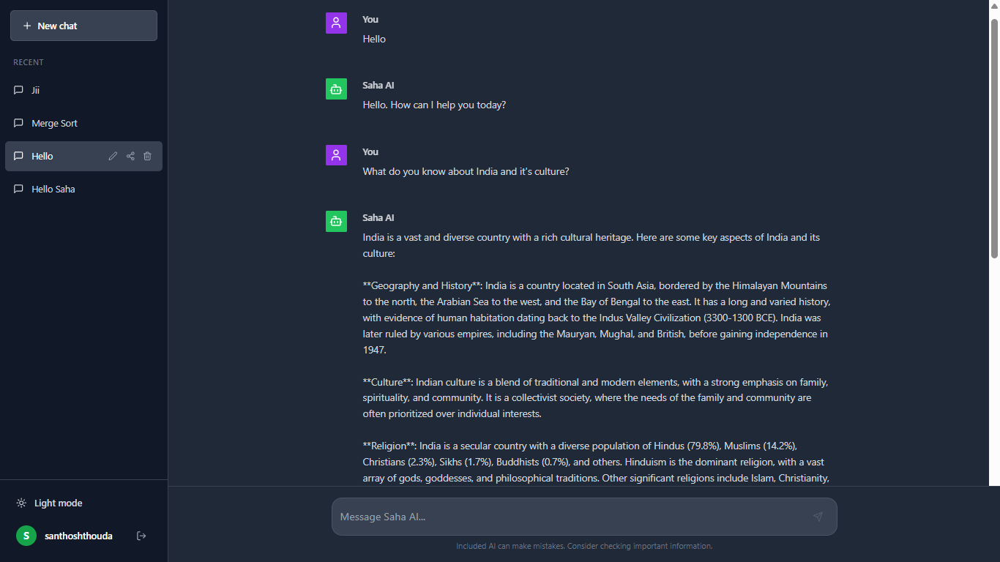

# Saha AI

Saha AI is a full-stack AI chatbot application designed to replicate the experience of modern Large Language Model interfaces. Built with the MERN stack (MongoDB, Express, React, Node.js) and powered by the Groq API, it offers a seamless, responsive, and feature-rich chat experience.

 *<!-- Replace with actual screenshot -->*

## 🚀 Features

-   **Intelligent Conversations**: Powered by Groq AI for fast and accurate responses.
-   **User Authentication**: Secure Signup, Login, and Forgot Password flows using JWT and email verification.
-   **Chat Management**:
    -   Create new chats.
    -   View chat history in a sidebar.
    -   Rename and delete chats.
    -   Share chat links.
-   **Modern UI/UX**:
    -   Clean, responsive design.
    -   Dark/Light mode toggle.
    -   Auto-scrolling and real-time typing indicators.
-   **Persistence**: All chats and messages are stored securely in MongoDB.

## 🛠️ Tech Stack

**Frontend:**
-   **Framework**: React (Vite)
-   **Styling**: Tailwind CSS
-   **Routing**: React Router DOM
-   **Icons**: Lucide React
-   **HTTP Client**: Axios

**Backend:**
-   **Runtime**: Node.js
-   **Framework**: Express.js
-   **Database**: MongoDB (Mongoose)
-   **Authentication**: JWT (JSON Web Tokens) & BcryptJS
-   **AI Integration**: Groq SDK
-   **Email Service**: Nodemailer

## 📦 Installation

### Prerequisites
-   Node.js (v16+)
-   MongoDB (Local or Atlas URI)
-   Groq API Key

### 1. Clone the Repository
```bash
git clone https://github.com/yourusername/SahaAI.git
cd SahaAI
```

### 2. Backend Setup
Navigate to the server directory and install dependencies:
```bash
cd server
npm install
```

Create a `.env` file in the `server` directory:
```env
PORT=5000
MONGO_URI=mongodb://localhost:27017/saha_ai_db
JWT_SECRET=your_super_secret_jwt_key
GROQ_API_KEY=your_groq_api_key

# Email Configuration (for Forgot Password)
SMTP_SERVICE=gmail
SMTP_EMAIL=your_email@gmail.com
SMTP_PASSWORD=your_email_app_password
```

Start the backend server:
```bash
npm run dev
```

### 3. Frontend Setup
Navigate to the client directory and install dependencies:
```bash
cd ../client
npm install
```

Start the frontend development server:
```bash
npm run dev
```

The application should now be running at `http://localhost:5173`.

## 📝 Usage

1.  **Sign Up**: Create a new account.
2.  **Start Chatting**: Type a message in the input bar to begin a conversation with Saha AI.
3.  **Manage Chats**: Use the sidebar to switch between conversations, rename them for clarity, or delete old ones.
4.  **Customize**: Toggle between Dark and Light mode using the button in the sidebar.

## 🤝 Contributing

Contributions are welcome! Please fork the repository and submit a pull request for any improvements.

## 📄 License

This project is licensed under the MIT License.
"# SahaAI" 
